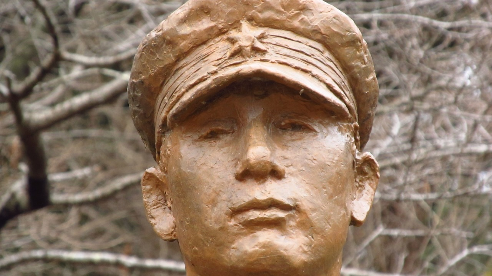

Astro Sarkaraは[The Open Graph Protocol] (OGP)の設定にデフォルトで対応しています。サイトメタデータ`siteMetadata.image`に`public/`ディレクトリに置いた画像ファイルのパス(**publicフォルダを起点としたファイルパス**)を設定することで、OGP画像を適用することができます。

```ts
export const siteMetadata = defineSiteMetadata({
  title: "Site title",
  description: "Site description",
  /**
   * publicフォルダを起点としたファイルパスを設定
   * /public/ogimage.jpeg の場合、以下のように設定
   */
  image: "/ogimage.jpeg",
});
```

## ページごとのOGP画像の設定

またAstro Sarkaraレイアウトの`image`属性に画像を設定することで、サイトメタデータの設定を上書きしてOGP画像ことができます。

### `public/`ディレクトリの画像

`public`ディレクトリに画像を置く場合は、サイトメタデータと同様にpublicフォルダを起点としたファイルパスを設定することで、サイトメタデータの設定を上書きすることができます。

```astro
---
import { SarkaraLayout } from "@cieloazul310/astro-sarkara";

---
<SarkaraLayout image="/ogp_second.png">
  {/* contents */}
</SarkaraLayout>
```

### `src/`傘下の画像

`src/`ディレクトリ傘下の画像を設定する場合は、Astroコンポーネントのフロントマターで画像をインポートして`<SarkaraLayout>`の`image`属性に設定してください。`src/`ディレクトリに置かれた画像はAstroの機能によって変換、最適化などの処理がされます。

```astro
---
import { SarkaraLayout } from "@cieloazul310/astro-sarkara";
import ogp from "../assets/ogp.png";

---
<SarkaraLayout image={ogp}>
  {/* contents */}
</SarkaraLayout>
```

Astroのコンテンツコレクションを使用する場合は、Markdownのフロントマターに`featuredImg`といったスキーマを設定することでレイアウトにOGP画像を渡すことができます。詳しくは以下のページを参照ください。

<PanelLink href="https://docs.astro.build/ja/guides/images/">画像</PanelLink>

[The Open Graph Protocol]: https://ogp.me/
